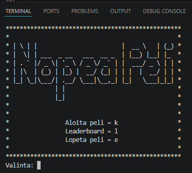

# Nopea Peli
Jere Peltonen

## Työmäärän jakautuminen  
Tein projektin itsenäisesti, jos tuli ongelmia johon tarvitsin apua niin pyysin kahdelta insinööri kavereilta apua.

## Sisällysluettelo:

- [Tietoa sovelluksesta](#tietoa-sovelluksesta) 
- [Pelit](#pelit)
- [Kuvakaappaukset](#kuvakaappaukset)  
- [Teknologiat](#teknologiat)  
- [Suunnitelma / Vuokaavio](#suunnittelu)  
- [Tila](#tila)  
- [Lähteet ja tekijät](#lähteet-ja-tekijät)  
- [Lisenssi](#lisenssi)  

## Tietoa sovelluksesta  
Nopea Peli on sovellus, joka on Nopea peli, ei mitään erikoista, tavoitteena on suorittaa 5 tai enemmän pientä peliä nopeasti, kun käyttäjä on pelannut kaikki pelit läpi niin saavat pisteet joka lisätään leaderboards taulukkoon, jokainen pelin suorituksen vaatimukset vaihtelevat joka kerta.

Ohjelma sisältää:

- [x] 6 erillaista peliä
- [x] Pisteet lisätään tiedostoonn leaderboard.csv
- [x] Pelit suoritetaan random järjestyksessä
- [x] Tyhjentää terminaalin joka kerta kun peli vaihtuu
- [x] Funktio johon voi tulevaisuudessa lisätä uusia pelejä

## Pelit

### Suuri tai pieni
- Peli jossa arvataan numero 1-100 asti, mitä lähellä on tuulee joko viesti "Liian suuri" tai "Liian pieni".
### Kirjoitus
- Peli jossa kirjoitetaan mitä ruudulla lukee, idea on että sana tai teksti otetaan satunnaisesti listasta tai tekstitiedostosta.
### Lasku
- Peli jossa vastaan matematiikka laskuun, jokainen kerta kysymys vaihtuu.
- Peli jossa pelaat kivi sakset paperia tekoälyä vastaan, voittaja on se joka päihittää toisen 3 kertaa.
### Numerojärjestys
- Peli jossa näytetään numerosarja jonka pelaaja laittaa oikeaan järjestykseen.
- Numerot laitetaan yksitellen
- Järjestys [4, 1, 8, 1, 5]
- Oikein [1, 1, 4, 5, 8]
### Parillinen vai Pariton
- Peli jossa vastataan onko satunnainen numero parillinen vai pariton.

## Kuvakaappaukset  

Kuva: [Jere Peltonen]

## Teknologiat  
Käytin projektissa Python ohjelmointi kieltä

## Suunnittelu
Kuvaile, miten lähestyit ongelmaa tai sovelluksen suunnittelua. Lisää tähän vuokaavio sovelluksen toiminnasta.

## Tila  
Nopea peli on nyt melkein valmis, pari hienosäätöä pelin tyylien ja pari viimeisen ominaisuuden lisääminen jäljellä.

## Lähteet ja tekijät  
Lista osallistujista ja lähteistä, joita käytit projektin aikana. Mainitse myös, jos käytit ChatGPT:tä tai muita tekoälytyökaluja ja miten ne auttoivat sinua.
# Tekijät
Jere Peltonen
Sain apua ongelmiin Juhanalta ja toiselta kaverilta joka haluaa olla nimetön. 

# Lähteet
- [ChatGPT] ideoimiseen ja joidenkin ongelmien avussa
- [Stack Overflow]
    - https://stackoverflow.com/questions/2084508/clear-the-terminal-in-python

## Lisenssi  
Valitse projektiisi sopiva lisenssi tämän [ohjeen](https://docs.github.com/en/communities/setting-up-your-project-for-healthy-contributions/adding-a-license-to-a-repository) avulla.

Esimerkki: MIT-lisenssi © [tekijä](author.com)
